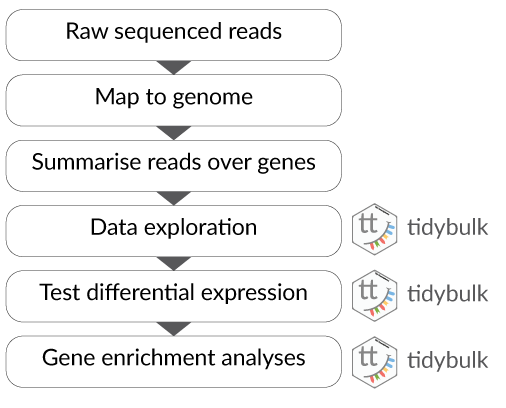

```{r, include = FALSE}
knitr::opts_chunk$set(
  collapse = TRUE,
  comment = "#>"
)
```

```{css, echo = FALSE}
# Formatting for polls
.poll {
background-color: #fff4d4;
}
.poll code {
	background-color: #fff4d4;
}
```

```{r, echo=FALSE, out.width = "100px"}
knitr::include_graphics("../inst/vignettes/tidybulk_logo.png")
```

# Schedule

- Part 1 Tidy Bulk RNA-seq analysis
- Part 2 Tidy Single-cell RNA-seq analysis

A more detailed schedule can be found [here](https://stemangiola.github.io/bioceurope2020_tidytranscriptomics/index.html#time-outline).  
<br>
**Format**: a few introductory slides, then demos, exercises plus Q&A.  
**Interact**: Zoom chat and polls
<br>
<br>

```{poll_1 class.source="poll"}
Poll: Will you code along and/or try out exercises during this workshop?
```


```{poll_2 class.source="poll"}
Poll: Do you have experience with transcriptomic analyses?
```

```{poll_3 class.source="poll"}
Poll: Do you have experience with tidyverse?
```

```{poll_3 class.source="poll"}
Poll: What are you more interested in learning in this workshop?
```


# What is transcriptomics?

“The transcriptome is the set of all RNA transcripts, including coding and non-coding, in an individual or a population of cells”

_Wikipedia_

```{r, echo=FALSE, out.width = "600px"}

```

# Why use transcriptomics?

- Genome (DNA) pretty stable
- Proteome (proteins) harder to measure
- Transcriptome (RNA) can measure changes in expression of thousands of coding and non-coding transcripts
<br>
<br>

# Possible experimental design

```{r, echo=FALSE, out.width = "600px"}
knitr::include_graphics("../inst/vignettes/ScreenShot2.png")
```

# How does transcriptomics work?

```{r, echo=FALSE, out.width = "600px"}

```

# Types of transcriptomic analyses

* **Differential expression**  
* **Cell type composition**  
* Alternative splicing  
* Novel transcript discovery  
* Fusions identification  
* Variant analysis  
<br>
Topics in bold we will see in this workshop
<br>
<br>

# Bulk RNA sequencing differential expression workflow

```{r, echo=FALSE, out.width = "600px"}

```

# Differences between bulk and single-cell RNA sequencing

```{r, echo=FALSE, out.width = "600px"}
knitr::include_graphics("../inst/vignettes/bulk_vs_single.jpg")
```

_Shalek and Benson, 2017_

# Single-cell RNA sequencing analysis workflow

```{r, echo=FALSE, out.width = "600px"}
knitr::include_graphics("../inst/vignettes/single_cell_RNAseq_pipeline.png")
```

# Getting started 

## Cloud

Easiest way to run this material. Only available during workshop. Thanks to ARDC for providing RStudio in the Nectar Research Cloud and Andy Botting from ARDC for helping to set up.

 * Login to https://rstudio.tidytranscriptomics-workshop.cloud.edu.au/rstudio/auth-sign-in with one of the supplied usernames and passwords
 * Open `tidytranscriptomics.Rmd` in `vignettes` folder
 

## Local

If you want to install on your own computer, see instructions [here](https://stemangiola.github.io/bioceurope2020_tidytranscriptomics/index.html#workshop-package-installation). We recommend using the Cloud during the bioceurope workshop and this method if you want to run the material after the workshop.

