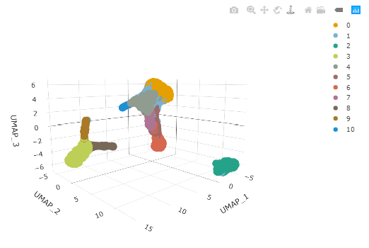

```{r, include = FALSE}
knitr::opts_chunk$set(
  collapse = TRUE,
  comment = "#>"
)
```

```{css, echo = FALSE}
# Formatting for polls
.poll {
background-color: #fff4d4;
}
.poll code {
	background-color: #fff4d4;
}
```

# Background

Background information and setup instructions for this workshop can be found [here](https://stemangiola.github.io/bioceurope2020_tidytranscriptomics/articles/background.html).


# Part 1 Bulk RNA-seq with tidybulk

This workshop will present how to perform analysis of RNA sequencing data following the tidy data paradigm [@wickham2014tidy]. The tidy data paradigm provides a standard way to organise data values within a dataset, where each variable is a column, each observation is a row, and data is manipulated using an easy-to-understand vocabulary. Most importantly, the data structure remains consistent across manipulation and analysis functions.

This can be achieved for RNA sequencing data with the [tidybulk](https://stemangiola.github.io/tidybulk/), [tidyHeatmap](https://stemangiola.github.io/tidyHeatmap) [@mangiola2020tidyheatmap] and [tidyverse](https://www.tidyverse.org/) [@wickham2019welcome] packages. The tidybulk package provides a tidy data structure and a modular framework for bulk transcriptional analyses. tidyHeatmap provides a tidy implementation of ComplexHeatmap. These packages are part of the tidytranscriptomics suite that introduces a tidy approach to RNA sequencing data representation and analysis


### Acknowledgements
Some of the material in Part 1 was adapted from an R for RNA sequencing workshop first run [here](http://combine-australia.github.io/2016-05-11-RNAseq/). Use of the airway dataset was inspired by the [DESeq2 vignette](http://bioconductor.org/packages/devel/bioc/vignettes/DESeq2/inst/doc/DESeq2.html).

```{r, echo=FALSE, out.width = "100px"}
knitr::include_graphics("../inst/vignettes/tidybulk_logo.png")
```


## Introduction
Measuring gene expression on a genome-wide scale has become common practice over the last two decades or so, with microarrays predominantly used pre-2008. With the advent of next generation sequencing technology in 2008, an increasing number of scientists use this technology to measure and understand changes in gene expression in often complex systems. As sequencing costs have decreased, using RNA sequencing to simultaneously measure the expression of tens of thousands of genes for multiple samples has never been easier. The cost of these experiments has now moved from generating the data to storing and analysing it.

There are many steps involved in analysing an RNA sequencing dataset. Sequenced reads are aligned to a reference genome, then the number of reads mapped to each gene can be counted. This results in a table of counts, which is what we perform statistical analyses on in R. While mapping and counting are important and necessary tasks, today we will be starting from the count data and showing how differential expression analysis can be performed in a friendly way using the Bioconductor package, tidybulk.


First, let’s load all the packages we will need to analyse the data. 

_Note: you should load the *tidybulk* library after the tidyverse core packages for best integration._

```{r message=FALSE, warning=FALSE}
# load libraries

# dataset
library(airway)

# tidyverse core packages
library(tibble)
library(dplyr)
library(tidyr)
library(readr)
library(stringr)
library(ggplot2)

# tidyverse-friendly packages
library(plotly)
library(ggrepel)
library(GGally)
library(tidyHeatmap)
library(tidybulk)
```

Plot settings. Set the colours and theme we will use for our plots.

```{r}
# Use colourblind-friendly colours
friendly_cols <- dittoSeq::dittoColors()

# Set theme
custom_theme <-
  list(
    scale_fill_manual(values = friendly_cols),
    scale_color_manual(values = friendly_cols),
    theme_bw() +
      theme(
        panel.border = element_blank(),
        axis.line = element_line(),
        panel.grid.major = element_line(size = 0.2),
        panel.grid.minor = element_line(size = 0.1),
        text = element_text(size = 12),
        legend.position = "bottom",
        strip.background = element_blank(),
        axis.title.x = element_text(margin = margin(t = 10, r = 10, b = 10, l = 10)),
        axis.title.y = element_text(margin = margin(t = 10, r = 10, b = 10, l = 10)),
        axis.text.x = element_text(angle = 30, hjust = 1, vjust = 1)
      )
  )
```

### Setting up the data

Here we will perform our analysis using the data from the *airway* package. The airway data comes from the paper by [@himes2014rna]; and it includes 8 samples from human airway smooth muscle cells, from 4 cell lines. For each cell line treated (with dexamethasone) and untreated (negative control) a sample has undergone RNA sequencing and gene counts have been generated.

The airway data is stored as a Bioconductor *RangedSummarizedExperiment* object. We will convert this object into a tidybulk tibble. A tibble is the tidyverse table format.

In this workshop we will be using the tidyverse pipe `%>%`. This 'pipes' the output from the command on the left into the command on the right/below. Using the pipe is not essential but it reduces the amount of code we need to write when we have multiple steps (as we'll see later). It also can make the steps clearer and easier to see. For more details on the pipe see [here](https://r4ds.had.co.nz/pipes.html).

```{r}
# load airway RNA sequencing data
data(airway)

# convert to tidybulk tibble
counts_airway <-
  airway %>%
  tidybulk()

# take a look
counts_airway
```


The `counts_airway` object contains information about genes and samples, the first column has the Ensembl gene identifier, the second column has the sample identifier and the third column has the gene transcription abundance. The abundance is the number of reads aligning to the gene in each experimental sample. The remaining columns include sample-wise information. The dex column tells us whether the samples are treated or untreated and the cell column tells us what cell line they are from.
We can shorten the sample names. We can remove the SRR1039 prefix that's present in all of them, as shorter names can fit better in some of the plots we will create. We can use `mutate()` together with `str_replace()` to remove the SRR1039 string from the sample column.
We can get the gene symbols for these Ensembl gene ids using the Bioconductor annotation package for human, `org.Hs.eg.db` and add them as a column using `mutate` again.
With tidyverse, all above steps can be linked with the `%>%`, as shown below. This has the benefits that
* no temporary variables need to be created
* less typing is required
* the steps can be seen more clearly.
```{r}
# setup data workflow
counts_tt <-
  airway %>%
  tidybulk() %>%
  mutate(sample = str_remove(sample, "SRR1039")) %>%
  mutate(symbol = AnnotationDbi::mapIds(org.Hs.eg.db::org.Hs.eg.db,
    keys = as.character(feature),
    keytype = "ENSEMBL",
    column = "SYMBOL",
    multiVals = "first"
  ))
# take a look
counts_tt
```

From this tidybulk tibble, we can perform differential expression analysis with the tidybulk package.

## Filtering lowly transcribed genes  
Genes with very low counts across all libraries provide little evidence for differential expression and they can interfere with some of the statistical approximations that are used later in the pipeline. They also add to the multiple testing burden when estimating false discovery rates, reducing power to detect differentially expressed genes. These genes should be filtered out prior to further analysis.

We can perform the filtering using tidybulk `keep_abundant` or `identify_abundant`. These functions can use the *edgeR* `filterByExpr` function described in [@law2016rna] to automatically identify the genes with adequate abundance for differential expression testing. By default, this will keep genes with ~10 counts in a minimum number of samples, the number of the samples in the smallest group. In this dataset the smallest group size is four (as we have four dex-treated samples versus four untreated). Alternatively, we could use `identify_abundant` to identify which genes are abundant or not (TRUE/FALSE), rather than just keeping the abundant ones. 

```{r}
# Filtering counts
counts_filtered <- counts_tt %>% keep_abundant(factor_of_interest = dex)

# take a look
counts_filtered
```
After running `keep_abundant` we have a column called `.abundant` containing TRUE  (`identify_abundant` would have TRUE/FALSE).

## Scaling counts to normalise

Scaling of counts, normalisation, is performed to eliminate uninteresting differences between samples due to sequencing depth or composition. A more detailed explanation can be found [here](https://hbctraining.github.io/DGE_workshop/lessons/02_DGE_count_normalization.html). In the tidybulk package the function `scale_abundance` generates scaled counts, with scaling factors calculated on abundant (filtered) transcripts and applied to all transcripts. We can choose from different normalisation methods. Here we will use the default, edgeR's trimmed mean of M values (TMM), [@robinson2010scaling]. TMM normalisation (and most scaling normalisation methods) scale relative to one sample.

```{r}
# Scaling counts
counts_scaled <- counts_filtered %>% scale_abundance()

# take a look
counts_scaled
```

After we run `scale_abundance` we should see some columns have been added at the end. The `counts_scaled` column contains the scaled counts.

We can visualise the difference of abundance densities before and after scaling. As tidybulk output is compatible with tidyverse, we can simply pipe it into standard tidyverse functions such as `filter`, `pivot_longer` and `ggplot`. We can also take advantage of ggplot's `facet_wrap` to easily create multiple plots.

```{r out.width = "70%"}
counts_scaled %>%

  # Reshaping
  pivot_longer(cols = c("counts", "counts_scaled"), names_to = "source", values_to = "abundance") %>%

  # Plotting
  ggplot(aes(x = abundance + 1, color = sample)) +
  geom_density() +
  facet_wrap(~source) +
  scale_x_log10() +
  custom_theme
```

In this dataset the distributions of the counts are not very different to each other before scaling but scaling does make the distributions more similar. If we saw a sample with a very different distribution we may need to investigate it.

As tidybulk smoothly integrates with ggplot2 and other tidyverse packages it can save on typing and make plots easier to generate. Compare the code for creating density plots with tidybulk versus standard base R below (standard code adapted from [@law2016rna]).

**tidybulk**

```{r eval=FALSE}
# tidybulk
airway %>%
  tidybulk() %>%
  keep_abundant(factor_of_interest = dex) %>%
  scale_abundance() %>%
  pivot_longer(cols = c("counts", "counts_scaled"), names_to = "source", values_to = "abundance") %>%
  ggplot(aes(x = abundance + 1, color = sample)) +
  geom_density() +
  facet_wrap(~source) +
  scale_x_log10() +
  custom_theme
```


**base R using edgeR**

```{r eval=FALSE}
# Example code, no need to run

# Prepare data set
library(edgeR)
dgList <- SE2DGEList(airway)
group <- factor(dgList$samples$dex)
keep.exprs <- filterByExpr(dgList, group = group)
dgList <- dgList[keep.exprs, , keep.lib.sizes = FALSE]
nsamples <- ncol(dgList)
logcounts <- log2(dgList$counts)

# Setup graphics
col <- RColorBrewer::brewer.pal(nsamples, "Paired")
par(mfrow = c(1, 2))

# Plot raw counts
plot(density(logcounts[, 1]), col = col[1], lwd = 2, ylim = c(0, 0.26), las = 2, main = "", xlab = "")
title(main = "Counts")
for (i in 2:nsamples) {
  den <- density(logcounts[, i])
  lines(den$x, den$y, col = col[i], lwd = 2)
}
legend("topright", legend = dgList$samples$Run, text.col = col, bty = "n")

# Plot scaled counts
dgList_norm <- calcNormFactors(dgList)
lcpm_n <- cpm(dgList_norm, log = TRUE)
plot(density(lcpm_n[, 1]), col = col[1], lwd = 2, ylim = c(0, 0.26), las = 2, main = "", xlab = "")
title("Counts scaled")
for (i in 2:nsamples) {
  den <- density(lcpm_n[, i])
  lines(den$x, den$y, col = col[i], lwd = 2)
}
legend("topright", legend = dgList_norm$samples$Run, text.col = col, bty = "n")
```


## Exploratory analyses

### Dimensionality reduction

By far, one of the most important plots we make when we analyse RNA sequencing data are principal-component analysis (PCA) or multi-dimensional scaling (MDS) plots. We reduce the dimensions of the data to identify the greatest sources of variation in the data. A principal components analysis is an example of an unsupervised analysis, where we don't need to specify the groups. If your experiment is well controlled and has worked well, what we hope to see is that the greatest sources of variation in the data are the treatments/groups we are interested in. It is also an incredibly useful tool for quality control and checking for outliers. We can use the `reduce_dimensions` function to calculate the dimensions.


```{r}
# Get principal components
counts_scal_PCA <-
  counts_scaled %>%
  reduce_dimensions(method = "PCA")
```

```{poll_4 class.source="poll"}
Poll: What fraction of variance is explained by PC3?
      See ?reduce_dimensions for how to get additional dimensions.
```

This joins the result to the counts object.

```{r}
# Take a look
counts_scal_PCA
```
For plotting, we can select just the sample-wise information with `pivot_sample`.

```{r}
# take a look
counts_scal_PCA %>% pivot_sample()
```

We can now plot the reduced dimensions.

```{r out.width = "70%"}
# PCA plot
counts_scal_PCA %>%
  pivot_sample() %>%
  ggplot(aes(x = PC1, y = PC2, colour = dex, shape = cell)) +
  geom_point() +
  geom_text_repel(aes(label = sample), show.legend = FALSE) +
  custom_theme
```

The samples separate by treatment on PC1 which is what we hope to see. PC2 separates the N080611 cell line from the other samples, indicating a greater difference between that cell line and the others.


### Hierarchical clustering with heatmaps

An alternative to principal component analysis for examining relationships between samples is using hierarchical clustering. Heatmaps are a nice visualisation to examine hierarchical clustering of your samples. tidybulk has a simple function we can use, `keep_variable`, to extract the most variable genes which we can then plot with tidyHeatmap.

```{r out.width = "70%"}
counts_scal_PCA %>%

  # extract 500 most variable genes
  keep_variable(.abundance = counts_scaled, top = 500) %>%

  # create heatmap
  heatmap(
    .column = sample,
    .row = feature,
    .value = counts_scaled,
    transform = log1p
  ) %>%
  add_tile(dex) %>%
  add_tile(cell)
```

In the heatmap we can see the samples cluster into two groups, treated and untreated, for three of the cell lines, and the cell line (N080611) again is further away from the others.

Tidybulk enables a simplified way of generating a clustered heatmap of variable genes. Compare the code below for tidybulk versus a base R method.

**base R using edgeR**
```{r eval=FALSE}
# Example code, no need to run

library(edgeR)
dgList <- SE2DGEList(airway)
group <- factor(dgList$samples$dex)
keep.exprs <- filterByExpr(dgList, group = group)
dgList <- dgList[keep.exprs, , keep.lib.sizes = FALSE]
dgList <- calcNormFactors(dgList)
logcounts <- cpm(dgList, log = TRUE)
var_genes <- apply(logcounts, 1, var)
select_var <- names(sort(var_genes, decreasing = TRUE))[1:500]
highly_variable_lcpm <- logcounts[select_var, ]
colours <- c("#440154FF", "#21908CFF", "#fefada")
col.group <- c("red", "grey")[group]
gplots::heatmap.2(highly_variable_lcpm, col = colours, trace = "none", ColSideColors = col.group, scale = "row")
```


## Differential expression

*tidybulk* integrates several popular methods for differential transcript abundance testing: the edgeR quasi-likelihood [@chen2016reads] (tidybulk default method), edgeR likelihood ratio [@mccarthy2012differential], limma-voom [@law2014voom] and DESeq2 [@love2014moderated]. A common question researchers have is which method to choose. With tidybulk we can easily run multiple methods and compare.

We give `test_differential_abundance` our tidybulk counts object and a formula, specifying the column that contains our groups to be compared. If all our samples were from the same cell line, and there were no additional factors contributing variance such as batch differences, we could use the formula `~ dex`. However, each treated and untreated sample is from a different cell line so we add the cell line as an additional factor `~ dex + cell`. 

```{r message=FALSE}
de_all <-

  counts_scal_PCA %>%

  # edgeR QLT
  test_differential_abundance(
    ~ dex + cell,
    method = "edgeR_quasi_likelihood",
    prefix = "edgerQLT_"
  ) %>%

  # edgeR LRT
  test_differential_abundance(
    ~ dex + cell,
    method = "edgeR_likelihood_ratio",
    prefix = "edgerLR_"
  ) %>%

  # limma-voom
  test_differential_abundance(
    ~ dex + cell,
    method = "limma_voom",
    prefix = "voom_"
  ) %>%

  # DESeq2
  test_differential_abundance(
    ~ dex + cell,
    method = "deseq2",
    prefix = "deseq2_"
  )

# take a look

de_all
```

This outputs the columns from each method such as log-fold change (logFC), false-discovery rate (FDR) and probability value (p-value). logFC is log2(treated/untreated).

### Comparison of methods

We can visually compare the significance for all methods. We will notice that there is some difference between the methods.

```{r message=FALSE}
de_all %>%
  pivot_transcript() %>%
  select(edgerQLT_PValue, edgerLR_PValue, voom_P.Value, deseq2_pvalue, feature) %>%
  ggpairs(1:4)
```

In order to decide which genes are differentially expressed, we usually take a cut-off of 0.05 on the FDR (or adjusted P value), NOT the raw p-value. This is because we are testing many genes (multiple testing), and the chances of finding differentially expressed genes is very high when you do that many tests. Hence we need to control the false discovery rate, which is the adjusted p-value column in the results table. What this means is that if 100 genes are significant at a 5% false discovery rate, we are willing to accept that 5 will be false positives. 

We can count how many differentially expressed genes there are, for example with the edgeR QLT method. We'll filter on FDR 0.05.

```{r}
de_all %>%
  filter(edgerQLT_FDR < 0.05) %>%
  summarise(num_de = n_distinct(feature))
```


```{poll_7 class.source="poll"}
Which method detects the most differentially abundant transcripts, p value adjusted for multiple testing <  0.05 (FDR, adj.P.Val, padj)?
```

_Note: Some of the methods produce columns with different names for similar outputs. If you wish to make these consistent you can do that with tidyverse `rename`. For example, to rename the p value adjusted columns you could run below._

```{r eval=FALSE}
de_all %>% rename(deseq2_FDR = deseq2_padj, voom_FDR = voom_adj.P.Val)
```

We can select some of the transcripts that look different between methods in the plot using the [*tidygate*](https://github.com/stemangiola/tidygate) package. We can then investigate these transcripts, for example, by visualising their counts.

With tidygate, we can interactively draw gates to select points we want using `gate`. We specify which columns we want to plot in the scatterplot, and how many gates we want to draw. We can also specify the opacity if we want to make it easier to see overlapping points.

```{r, eval=FALSE}
de_gate <-
  de_all %>%

  tidygate::gate(
    feature,
    edgerQLT_PValue,
    deseq2_pvalue,
    opacity = 0.3,
    how_many_gates = 2
  )
```

We then click to draw gates around the points we want, for example as shown in the screenshot below.

```{r, echo=FALSE}
knitr::include_graphics("../inst/vignettes/comparison_different_DE_methods_gates.png")
```

That will add a column called gate, specifying which gate the points (transcripts) are in.

```{r echo=FALSE}
# using pre-selected gates just to render the html version of this document
de_gate <-
  de_all %>%

  tidygate::gate(
    feature,
    edgerQLT_PValue,
    deseq2_pvalue,
    gate_list = bioceurope2020tidytranscriptomics::de_gate_gates
  )

de_gate
```

We can check how many transcripts we've got in each gate.

```{r}
de_gate %>%
  pivot_transcript() %>%
  count(gate)
```

We can now select the transcripts from our two gates i.e. more significant in edgeR (gate 1) and more significant in DESeq2 (gate 2) and visualise the counts for each sample in the treated and untreated groups.

```{r}
de_gate %>%

  # Filter for transcripts within the gates
  filter(gate > 0) %>%

  # Rename for clarity
  mutate(gate = case_when(
    gate == 1 ~ "more in edgeR",
    gate == 2 ~ "more in DESeq2",
    TRUE ~ gate
  )) %>%

  # Order the plots for the transcripts
  mutate(feature = forcats::fct_reorder(feature, edgerQLT_PValue, min)) %>%

  # Plot
  ggplot(aes(dex, counts_scaled, color = gate)) +
  geom_point() +
  facet_wrap(~feature, scale = "free_y", ncol = 4) +
  custom_theme
```

We could also check the log fold changes for these genes and see, for example, that DESeq2 produces a more conservative logFC statistic for the gene `ENSG00000104725`.

```{r}
de_gate %>%
  pivot_transcript() %>%
  filter(feature == "ENSG00000104725") %>%
  select(edgerQLT_logFC, deseq2_log2FoldChange)
```

### Single method

If we just wanted to run one differential testing method we could do that. The default method is edgeR quasi-likelihood.

```{r}
counts_de <- counts_scal_PCA %>%
  test_differential_abundance(~ dex + cell)
```

Tidybulk enables a simplified way of performing an RNA sequencing differential expression analysis (with the benefit of smoothly integrating with ggplot2 and other tidyverse packages). Compare the code for a tidybulk edgeR analysis versus standard edgeR below.

**standard edgeR**
```{r eval=FALSE}
# Example code, no need to run

library(edgeR)
dgList <- SE2DGEList(airway)
group <- factor(dgList$samples$dex)
keep.exprs <- filterByExpr(dgList, group = group)
dgList <- dgList[keep.exprs, , keep.lib.sizes = FALSE]
dgList <- calcNormFactors(dgList)
cell <- factor(dgList$samples$cell)
design <- model.matrix(~ group + cell)
dgList <- estimateDisp(dgList, design)
fit <- glmQLFit(dgList, design)
qlf <- glmQLFTest(fit, coef=2)
```


## Plots after testing for differentially expressed

We'll extract the symbols for a few top genes (by P value) to use in some of the plots we will make.

```{r}
topgenes_symbols <-
  counts_de %>%
  pivot_transcript() %>%
  arrange(PValue) %>%
  head(6) %>%
  pull(symbol)
```

### Volcano plots

Volcano plots are a useful genome-wide plot for checking that the analysis looks good. Volcano plots enable us to visualise the significance of change (p-value) versus the fold change (logFC). Highly significant genes are towards the top of the plot. We can also colour significant genes (e.g. genes with false-discovery rate < 0.05)

```{r out.width = "70%"}
# volcano plot, minimal
counts_de %>%
  ggplot(aes(x = logFC, y = PValue, colour = FDR < 0.05)) +
  geom_point() +
  scale_y_continuous(trans = "log10_reverse") +
  custom_theme
```

A more informative plot, integrating some of the packages in tidyverse.

```{r out.width = "70%", warning=FALSE}
counts_de %>%
  pivot_transcript() %>%

  # Subset data
  mutate(significant = FDR < 0.05 & abs(logFC) >= 2) %>%
  mutate(symbol = ifelse(symbol %in% topgenes_symbols, as.character(symbol), "")) %>%

  # Plot
  ggplot(aes(x = logFC, y = PValue, label = symbol)) +
  geom_point(aes(color = significant, size = significant, alpha = significant)) +
  geom_text_repel() +

  # Custom scales
  custom_theme +
  scale_y_continuous(trans = "log10_reverse") +
  scale_color_manual(values = c("black", "#e11f28")) +
  scale_size_discrete(range = c(0, 2))
```

### Stripcharts

Before following up on the differentially expressed genes with further lab work, it is also recommended to have a look at the expression levels of the individual samples for the genes of interest. We can use stripcharts to do this. These will help show if expression is consistent amongst replicates in the groups.

With stripcharts we can see if replicates tend to group together and how the expression compares to the other groups. We'll also add a box plot to show the distribution. Tidyverse faceting makes it easy to create a plot for each gene.

```{r out.width = "70%"}
strip_chart <-
  counts_scaled %>%

  # extract counts for top differentially expressed genes
  filter(symbol %in% topgenes_symbols) %>%

  # make faceted stripchart
  ggplot(aes(x = dex, y = counts_scaled + 1, fill = dex, label = sample)) +
  geom_boxplot() +
  geom_jitter() +
  facet_wrap(~symbol) +
  scale_y_log10() +
  custom_theme

strip_chart
```


## Interactive Plots

A really nice feature of using tidyverse and ggplot2 is that we can make interactive plots quite easily using the plotly package. This can be very useful for exploring what genes or samples are in the plots. We can make interactive plots directly from our ggplot2 object (strip_chart). Having `label` in the `aes` is useful to visualise the identifier of the data point (here the sample id) or other variables when we hover over the plot.

We can also specify which parameters from the `aes` we want to show up when we hover over the plot with `tooltip`.

```{r, out.width = "70%", warning=FALSE}
strip_chart %>% ggplotly(tooltip = c("label", "y"))
```


## Automatic bibliography

Tidybulk provides a handy function called `get_bibliography` that keeps track of the references for the methods used in your tidybulk workflow. The references are in BibTeX format and can be imported into your reference manager.

```{r}
get_bibliography(counts_de)
```


## Tidybulk ADD versus GET modes

In the next parts we will see `action="get"` being used with some tidybulk functions, so we will explain here what it is doing.

Every tidybulk function takes a tidybulk tibble as input, and  
 * `action="add"` outputs the new information joined to the original input data frame (default)  
 * `action="get"` outputs the new information with only the sample or transcript information, depending on what the analysis is
 
For example, with `action="add"` (default), we can add the PCA dimensions to the original data set. So we still have a row for every transcript in every sample.

```{r}
counts_scaled %>%
  reduce_dimensions(
  method = "PCA",
  action = "add")
```

Or with `action= "get"` we can add the PCA dimensions to the original data set selecting just the sample-wise columns. Note that we now have just one row for every sample.

```{r}
counts_scaled %>%
  reduce_dimensions(
  method = "PCA",
  action = "get")
```

## Cell type composition analysis

If we are sequencing tissue samples, we may want to know what cell types are present and if there are differences in expression between them. `tidybulk` has a `deconvolve_cellularity` function that can help us do this.

For this example we will use a subset of the breast cancer dataset from [The Cancer Genome Atlas (TCGA)](https://www.cancer.gov/tcga). 

```{r}
BRCA_tidy <-
  bioceurope2020tidytranscriptomics::BRCA %>%
  tidybulk(patient, transcript, count)

BRCA_tidy
```

With tidybulk, we can easily infer the proportions of cell types within a tissue using one of several published methods (Cibersort [@newman2015robust], EPIC [@racle2017simultaneous] and llsr [@abbas2009deconvolution]). Here we will use Cibersort which provides a default signature called LM22 to define the cell types. LM22 contains 547 genes that identify 22 human immune cell types.

```{r}
BRCA_cell_type <-
  BRCA_tidy %>%
  deconvolve_cellularity(action = "get")

BRCA_cell_type
```

Cell type proportions are added to the tibble as new columns. The prefix makes it easy to reshape the data frame if needed, for visualisation or further analyses.

```{r}
BRCA_cell_type_long <-
  BRCA_cell_type %>%

  # Reshape
  pivot_longer(
    contains("cibersort"),
    names_prefix = "cibersort: ",
    names_to = "cell_type",
    values_to = "proportion"
  )

BRCA_cell_type_long
```

We can plot the proportions of immune cell types for each patient.

```{r}
BRCA_cell_type_long %>%

  # Plot proportions
  ggplot(aes(x = patient, y = proportion, fill = cell_type)) +
  geom_bar(stat = "identity") +
  custom_theme
```

We can visualise the similarity of the tissue composition for the patients by performing a dimensionality reduction on cell type and proportion (rather than on transcript and counts as we did previously).

```{r warning=FALSE}
BRCA_cell_type_long %>%

  # Filter cell types with proportion zero in all patients
  group_by(cell_type) %>%
  filter(sum(proportion) > 0) %>%
  ungroup() %>%
  reduce_dimensions(
    patient,
    cell_type,
    proportion,
    method = "PCA",
    action = "get"
  ) %>%
  ggplot(aes(PC1, PC2, label = patient)) +
  geom_point(color = "red") +
  ggrepel::geom_text_repel(size = 3) +
  custom_theme
```

```{poll_8 class.source="poll"}
Poll: What is the most abundant cell type overall in BRCA samples?
```

We can also perform differential tissue composition analyses, similar to how we performed differential transcript abundance analyses. We use tidybulk's `test_differential_cellularity` and can perform our analyses using a known factor of interest, such as tumour subtype, or using survival data. Here we use survival data available from TCGA [@liu2018integrated].

```{r}
library(survival)

BRCA_tidy_survival <-
  BRCA_tidy %>%
  test_differential_cellularity(Surv(time, event_occurred) ~ ., cores = 1) %>%
  arrange(p.value)

BRCA_tidy_survival %>%
  dplyr::select(.cell_type, p.value, everything())
```

We can visualise the proportions for the cell types most associated with survival.

```{r}
BRCA_tidy_survival %>%
  dplyr::slice(1:2) %>%
  unnest(cell_type_proportions) %>%
  ggplot(aes(time, .proportion, color = factor(event_occurred))) +
  geom_point() +
  facet_wrap(~.cell_type) +
  scale_x_log10() +
  scale_y_continuous(trans = "logit") +
  custom_theme
```


## Key Points

- RNA sequencing data can be represented and analysed in a 'tidy' way using tidybulk and the tidyverse
- With the modularity offered by piping we don't need to create variables, unless an object is used more than one. This improves robustness of the code.
- The principles of tidy transcriptomics are to interface as much as possible with commonly known manipulation and visualisation tools, rather than creating custom functions.
- Some of the key steps in an RNA sequencing analysis are (i) filtering lowly abundant transcripts, (ii) adjusting for differences in sequencing depth and composition, (iii) testing for differential expression
- Dimensionality reduction (PCA or MDS) plots are very important for exploring the data
- Density plots, volcano plots, strip-charts and heatmaps are useful visualisation tools for evaluating the hypothesis testing.
- `tidybulk` allows streamlined multi-method analyses
- `tidybulk` allow easy analyses of cell type composition
- Testing for differences in tissue composition between samples is analogous to the testing for differences in transcript abundance 

## Supplementary
Some things we don't have time to cover in Part 1 of this workshop can be found in the [Supplementary material](https://stemangiola.github.io/bioceurope2020_tidytranscriptomics/articles/supplementary.html).

# Part 2 Bulk RNA-seq with tidySummarizedExperiment and Bioconductor

# Tidify `SummarizedExperiment` into `tidySummarizedExperiment`

This is a SummarizedExperiment object but it is evaluated as tibble. So it is fully compatible both with SummarizedExperiment and tidyverse APIs. 

```{r}
library(tidySummarizedExperiment)
pasilla_tidy <- airway %>% tidy()
```

**It looks like a tibble**

```{r}
pasilla_tidy
```

**But it is a SummarizedExperiment object after all**

```{r}
assays(pasilla_tidy)
```


# Tidyverse commands

We can use tidyverse commands to explore the tidy SummarizedExperiment object.

We can use `slice` to choose rows by position, for example to choose the first row.

```{r}
pasilla_tidy %>% slice(1)
```

We can use `filter` to choose rows by criteria.

```{r}
pasilla_tidy %>% filter(dex == "untrt")
```

We can use `select` to choose columns.

```{r}
pasilla_tidy %>% select(sample)
```

We can use `count` to count how many rows we have for each sample.

```{r}
pasilla_tidy %>% count(sample)
```

We can use `distinct` to see what distinct sample information we have.

```{r}
pasilla_tidy %>% distinct(sample, dex, cell)
```

We could use `rename` to rename a column. For example, to modify the type column name.

```{r}
pasilla_tidy %>% rename(treatment_status=dex)
```

We could use `mutate` to create a column. For example, we could create a new type column that contains single
and paired instead of single_end and paired_end.

```{r}
pasilla_tidy %>% mutate(type=str_remove(sample, "SRR1039"))
```

We could use `unite` to combine multiple columns into a single column.

```{r}
pasilla_tidy %>% unite("combined", c(dex, cell))
```

We can also combine commands with the tidyverse pipe `%>%`.

For example, we could combine `group_by` and `summarise` to get the total counts for each sample.

```{r}
pasilla_tidy %>%
    group_by(sample) %>%
    summarise(total_counts=sum(counts))
```

We could combine `group_by`, `mutate` and `filter` to get the transcripts with mean count > 0.

```{r}
pasilla_tidy %>%
    group_by(seqnames ) %>%
    mutate(mean_count=mean(counts)) %>%
    filter(mean_count > 0)
```


## Plotting

We can treat `pasilla_tidy` as a normal tibble for plotting. Here we plot the distribution of counts per sample.

```{r plot1}
pasilla_tidy %>%
    ggplot(aes(counts + 1, group=sample, color=`dex`)) +
    geom_density() +
    scale_x_log10() +
    custom_theme
```


# Part 3 Single-cell RNA-seq with tidySingleCellExperiment

[Background information](https://stemangiola.github.io/bioceurope2020_tidytranscriptomics/articles/background.html#differences-between-bulk-and-single-cell-rna-sequencing-1)

In Part 1 we showed how we can study the cell-type composition of a biological sample using bulk RNA sequencing.  Single cell sequencing enables a more direct estimation of cell-type composition and gives greater resolution. For bulk RNA sequencing we need to infer the cell types using the abundance of transcripts in the whole sample, with single-cell RNA sequencing we can directly measure the transcripts in each cell and then classify the cells into cell types. 

## Introduction to tidyseurat

Seurat is a very popular analysis toolkit for single cell RNA sequencing data [@butler2018integrating; @stuart2019comprehensive]. tidyseurat provides a bridge between the Seurat single-cell package and the tidyverse. It creates an invisible layer that enables viewing the
Seurat object as a tidyverse tibble, and provides Seurat-compatible *dplyr*, *tidyr*, *ggplot* and *plotly* functions.


```{r message=FALSE, warning=FALSE}

# load additional libraries
library(bioceurope2020tidytranscriptomics)
library(dplyr)
library(ggplot2)
library(purrr)
library(stringr)
library(SummarizedExperiment)
library(SingleCellExperiment)
library(scater)
library(scran)
library(igraph)
library(batchelor)
library(SingleR)
library(scuttle)
library(EnsDb.Hsapiens.v86)
library(celldex)
library(ggbeeswarm)
library(tidySingleCellExperiment)
```


The single-cell RNA sequencing data used here is 3000 cells in total, subsetted from 20 samples from 10 peripheral blood mononuclear cell (pbmc) datasets. The datasets are from GSE115189/SRR7244582 [@Freytag2018], SRR11038995 [@Cai2020, SCP345 (singlecell.broadinstitute.org), SCP424 [@Ding2020], SCP591 [@Karagiannis2020] and 10x-derived 6K and 8K datasets (support.10xgenomics.com/). 

```{r}
pbmc <- bioceurope2020tidytranscriptomics::pbmc

dim(pbmc)
```

### Create `tidyseurat`

This is a seurat object but it is evaluated as tibble. So it is fully compatible both with Seurat and tidyverse APIs.

```{r}
pbmc_tidy <- pbmc %>% tidy()
```

**It looks like a tibble**

```{r}
pbmc_tidy
```

**But it is a Seurat object after all**

So it can be interacted with using [SingleCellExperiment commands](https://bioconductor.org/packages/release/bioc/vignettes/SingleCellExperiment/inst/doc/intro.html) such as `assayNames`.

```{r}
assayNames(pbmc_tidy) # from SummarizedExperiment
```

## Polish the data

We can also interact with our object as we do with any tidyverse tibble. In this case we want to polish an annotation column. We will extract the sample and dataset names from the file name column into separate columns.

```{r}
pbmc_tidy <-
  pbmc_tidy %>%

  # Extract sample and group
  extract(file, "sample", "../data/([a-zA-Z0-9_]+)/outs.+", remove = FALSE) %>%

  # Extract data source
  extract(file, c("dataset", "groups"), "../data/([a-zA-Z0-9_]+)_([0-9])/outs.+")

pbmc_tidy
```

## Quality control

A key quality control step performed in single cell analysis is assessment of the proportion of mitochondrial transcripts. A high mitochondrial count can indicate the cell is dead or dying and is thus poor quality. A powerful combination of tools we can use with tidyseurat is tidyverse's [nest](https://rstudio-education.github.io/tidyverse-cookbook/transform-tables.html#nest-a-data-frame) and `map`. This enables us to easily perform independent analyses on subsets of the data. For example, we can nest by dataset and use map to iterate the analysis of mitochondrial content across each dataset.

```{r}
# Get chromosomal location for gene symbols
location <- mapIds(
  EnsDb.Hsapiens.v86,
  keys = rownames(pbmc_tidy),
  column = "SEQNAME",
  keytype = "SYMBOL"
)

pbmc_tidy <-
  pbmc_tidy %>%

  # Grouping - nesting by dataset
  nest(data = -dataset) %>%
  mutate(mitochondrion_info = map(
    data,
    ~ # Calculating mitochondrial statistics
      perCellQCMetrics(.x, subsets = list(Mito = which(location == "MT"))) %>%
      
      # Converting to tibble
      as_tibble(rownames = "cell") %>%

      # Label cells with high mitochondrial content
      mutate(high_mitochondrion = isOutlier(subsets_Mito_percent, type = "higher"))
  )) %>%
  
  # Join the information
  mutate(data = map2(
    data, mitochondrion_info,
    ~ left_join(.x, .y, by = "cell")
  )) %>%
  
  select(-mitochondrion_info) %>%
  
  unnest(data)
```

We can use tidyverse to reshape the data and create beeswarm plots to visualise the mitochondrial content. 

```{r, warning=FALSE}
pbmc_tidy %>%

  # Reshaping
  pivot_longer(c(detected, sum, subsets_Mito_percent)) %>%
  ggplot(aes(
    x = dataset, y = value,
    color = high_mitochondrion,
    alpha = high_mitochondrion,
    size = high_mitochondrion
  )) +

  # Plotting
  geom_quasirandom() +
  facet_wrap(~name, scale = "free_y") +

  # Customisation
  scale_color_manual(values = c("black", "#e11f28")) +
  scale_size_discrete(range = c(0, 2)) +
  theme_bw() +
  theme(axis.text.x = element_text(angle = 50, hjust = 1, vjust = 1))
```

In the faceted plot, detected is number of genes in each of the 10 datasets, sum is total counts.

```{poll_5 class.source="poll"}
What is the ID of the cell with the highest mitochondrial relative content?
```

We filter out cells with high mitochondrial content.

```{r}
pbmc_tidy <- pbmc_tidy %>% filter(!high_mitochondrion)
```

## Scaling and Integrating

We need to integrate the different datasets to adjust for technical variability between them. For integration we have chosen 10x_8K (dataset number 3) as reference because it is relatively high quality.

```{r preprocess seurat, message=FALSE, warning=FALSE}
# Scaling within each dataset
pbmc_tidy <-
  pbmc_tidy %>%

  # Define batch
  mutate(batch = dataset) %>%
  nest(data = -batch) %>%

  # Normalisation   
  mutate(data = multiBatchNorm(data)) %>%

  pull(data) %>%
  
  fastMNN() %>%

  tidy()


```

## Reduce dimensions

Besides PCA which is a linear dimensionality reduction, we can apply neighbour aware methods such as UMAP, to better define locally similar cells. We can calculate the first 3 UMAP dimensions using the Seurat framework.

```{r umap seurat, warning=FALSE}
# Perform PCA with scater
pbmc_tidy <-
  pbmc_tidy %>%
  runUMAP(ncomponents = 3, dimred="corrected") # from scater
```

And we can plot the output as a 3D plot using plotly. With this we can check if the datasets are clustering independently, indicating a batch effect, or if they are mixed together and cells are clustering by cell type.

```{r umap plot seurat, eval=FALSE}
pbmc_tidy %>%
  plot_ly(
    x = ~`UMAP1`,
    y = ~`UMAP2`,
    z = ~`UMAP3`,
    colors = friendly_cols[1:10],
    color = ~batch
  )
```


```{r, echo=FALSE}
knitr::include_graphics("../inst/vignettes/plotly_1.png")
```

## Identify clusters 

We proceed with cluster identification with Seurat. FindNeighbors constructs a Shared Nearest Neighbor (SNN) Graph for a given dataset. The k-nearest neighbours of each cell are first determined. FindClusters identifies clusters of cells by a shared nearest neighbour (SNN). 

```{r cluster}
# Assign clusters to the 'colLabels'
# of the SingleCellExperiment object
colLabels(pbmc_tidy) <- # from SingleCellExperiment
  pbmc_tidy %>%
  buildSNNGraph(use.dimred="corrected") %>% # from scran - shared nearest neighbour
  cluster_walktrap() %$% # from igraph
  membership %>%
  as.factor()

# Reorder columns
pbmc_tidy %>% select(label, everything())
```


Now we can interrogate the object as if it was a regular tibble data frame.

```{r cluster count seurat}
pbmc_tidy %>%
  count(label)
```

And we can plot the clusters as a 3D plot using plotly. This time we are colouring by estimated cluster labels to visually check the cluster labels.

```{r umap plot 2, eval=FALSE}
pbmc_tidy %>%
  plot_ly(
    x = ~`UMAP1`,
    y = ~`UMAP2`,
    z = ~`UMAP3`,
    colors = friendly_cols[1:10],
    color = ~label
  )
```

```{r, echo=FALSE}

```

## Cell type classification

### Manual cell type classification

We can identify cluster markers (genes) using Seurat. As example, we are selecting the top 10 for each cluster. The function DoHeatmap builds an heatmap of those gene markers across cells.

```{r}
# Identify top 10 markers per cluster
marker_genes <-
    pbmc_tidy %>%
    findMarkers(groups=pbmc_tidy$label, assay.type = "reconstructed") %>%
    as.list() %>%
    map(~ head(.x, 10) %>%  rownames()) %>%
    unlist()

# Plot heatmap
pbmc_tidy %>%
  plotHeatmap(                                  # from scater
    features=marker_genes, 
    columns=order(pbmc_tidy$label), 
    colour_columns_by=c("label"), 
    exprs_values  = "reconstructed"
  ) 

```

### Automatic cell type classification

We can infer cell type identities (e.g. T cell) using *SingleR* [@aran2019reference] and manipulate the output using tidyverse. SingleR [accepts any log-normalised transcript abundance matrix](https://bioconductor.org/packages/devel/bioc/vignettes/SingleR/inst/doc/SingleR.html)

```{r}
# Reference cell types
blueprint <- BlueprintEncodeData()

cell_type <-
    
  # extracting counts from SingleCellExperiment object
  assays(pbmc_tidy)$reconstructed%>%

    # SingleR
  SingleR(
    ref = blueprint,
    labels = blueprint$label.main,
    clusters = pbmc_tidy %>% pull(label)
  ) %>%
    
    # Formatting results
  as.data.frame() %>%
  as_tibble(rownames = "label") %>%
  select(label, first.labels)
```

We join the cluster label dataframe to our tidyseurat tibble.

```{r}
# Join cell type info
pbmc_tidy <-
  pbmc_tidy %>%
  left_join(cell_type, by = "label")

# Reorder columns
pbmc_tidy %>% select(cell, first.labels, everything())
```

We can easily summarise the results. For example, we can see how cell type classification overlaps with cluster classification.

```{r}
pbmc_tidy %>% count(label, first.labels)
```

```{poll_6 class.source="poll"}
How many cells are classified differently by SingleR when analyses are done by cluster (as above) or by cell (omitting the argument `clusters`). Tip: you can answer this question without creating any variable, using left_join.
```


## Pseudobulk analyses

It is sometime useful to aggregate cell-wise transcript abundance into pseudobulk samples. It is possible to explore data and perform hypothesis testing with tools and data-source that we are more familiar with. For example, we can use edgeR in tidybulk to perform differential expression testing. For more details on pseudobulk analysis see [here](https://hbctraining.github.io/scRNA-seq/lessons/pseudobulk_DESeq2_scrnaseq.html).

### Data exploration using pseudobulk samples

To do this, we will load a helper function called `aggregate_cells` from [GitHub Gist](https://gist.github.com/stemangiola/ebce5a3f931b298611b56680d39c073c) and use it to create a group for each sample.

```{r warning=FALSE, message=FALSE}
# Load aggregate function
devtools::source_gist("889e4089a0e5ca2649d3c9164e3b542e")

# Aggregate
pbmc_bulk = 
  tidy(pbmc) %>% 
  aggregate_cells(file) 

pbmc_bulk
```

```{r}

pbmc_bulk %>%
  
  # Tidybulk operations
  tidybulk(file, transcript, abundance_counts) %>%
  tidybulk::identify_abundant() %>%
  tidybulk::scale_abundance()
```

## Key Points
- Some basic steps of a single-cell RNA sequencing analysis are dimensionality reduction, cluster identification and cell type classification
- `tidyseurat` is an invisible layer that operates on a `Seurat` object and enables us to visualise and manipulate data as if it were a tidy data frame.
- `tidyseurat` object is a `Seurat object` so it can be used with any `Seurat` compatible method
- `tidySingleCellExperiment` is an invisible layer that operates on a `SingleCellExperiment` object and enables us to visualise and manipulate data as if it were a tidy data frame.
- `tidySingleCellExperiment` object is a `SingleCellExperiment object` so it can be used with any `SingleCellExperiment` compatible method

# Contributing
If you want to suggest improvements for this workshop or ask questions, you can do so as described [here](https://github.com/stemangiola/bioceurope2020_tidytranscriptomics/blob/master/CONTRIBUTING.md).

# Reproducibility
Record package and version information with `sessionInfo`

```{r}
sessionInfo()
```

# References
